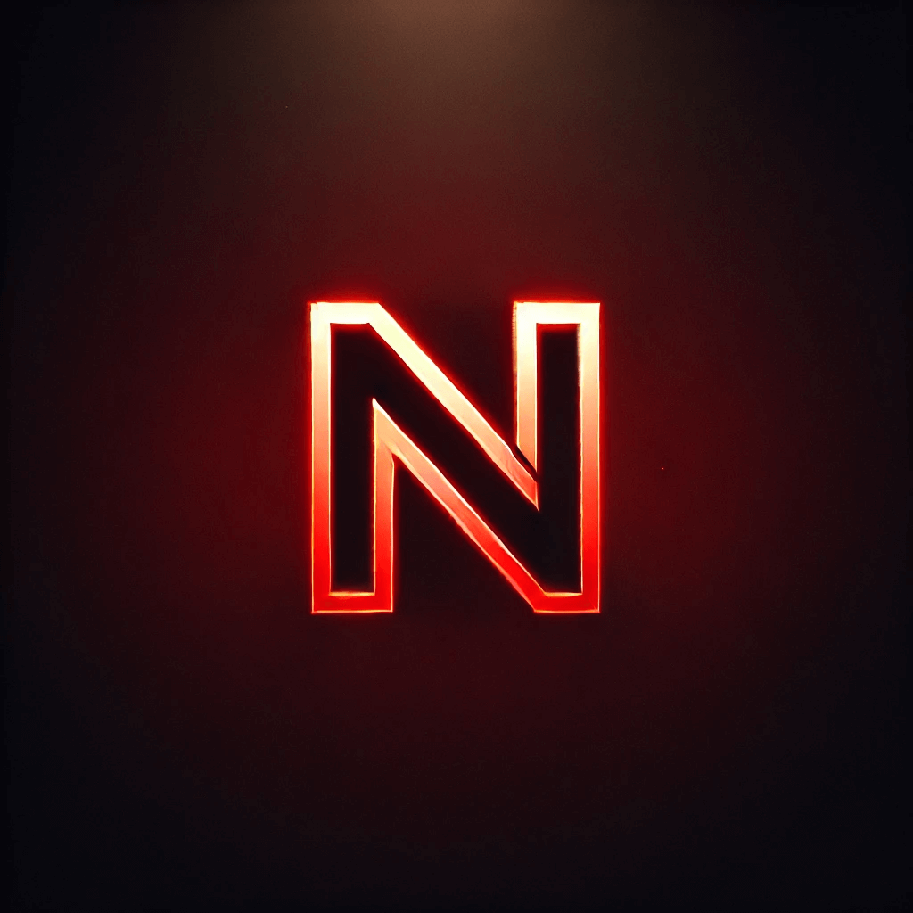

# N3xus



## Overview

N3xus is a 3D action-adventure game built with Godot Engine 4.3. The game features an open world with vehicles, combat mechanics, missions, and enemies within a futuristic setting.

## Features

- **First-person shooter gameplay** with character movement and combat
- **Vehicle system** allowing players to enter and pilot jets and cars
- **Enemy AI** with patrolling, detection, and combat behaviors
- **Mission system** with objectives and progress tracking
- **Interactive environment** with buildings and terrain
- **Settings and pause menus** with full keyboard/gamepad support
- **Dynamic UI** with health tracking and mission information

## System Requirements

- Windows/Mac/Linux
- Godot Engine 4.3 or higher
- 2GB RAM minimum
- 500MB disk space

## Setup Guide

### Prerequisites

1. Install [Godot Engine 4.3](https://godotengine.org/download) or higher

### Installation

1. Clone the repository:
   ```
   git clone https://github.com/yourusername/n3xus-godot-game.git
   ```
   or download and extract the ZIP file

2. Open Godot Engine
3. Click "Import" and navigate to the project directory
4. Select the `project.godot` file
5. Click "Import & Edit"

### Running the Game

- From the Godot editor, press F5 or click the "Play" button in the top-right corner
- Alternatively, export the project for your target platform through Project > Export

## Controls

### Keyboard

- **WASD**: Movement
- **Mouse**: Look around
- **Space**: Jump
- **Shift**: Run
- **E**: Interact/Enter vehicles
- **Q**: Exit vehicles
- **R**: Shoot
- **P**: Pause menu

### Gamepad

- **Left Stick**: Movement
- **Right Stick**: Look around
- **A/Cross**: Jump
- **Right Trigger**: Run
- **X/Square**: Interact/Enter vehicles
- **B/Circle**: Exit vehicles
- **Y/Triangle**: Shoot
- **Start**: Pause menu

## Gameplay

### Basic Movement

The player has standard FPS movement controls with the ability to run, jump, and navigate the world.

### Vehicles

- Approach vehicles (jets or cars) and press E to enter
- Use standard movement controls to pilot
- Press Q to exit vehicles

### Combat

- Engage enemies by shooting projectiles
- Avoid enemy attacks to prevent health damage
- Health is displayed in the UI

### Missions

- Look for mission start points throughout the world
- Interact with them to begin missions
- Complete objectives (like eliminating enemies) to progress

## Development

The game is built using Godot's native GDScript language and utilizes:

- Godot's 3D physics system for character and vehicle movement
- Custom shaders for visual effects
- State machine patterns for enemy AI
- Scene instancing for projectiles and other dynamic elements

## Credits

- Game Engine: [Godot Engine](https://godotengine.org/)
- Font: Transformers Movie Font
- Audio: Ambient atmosphere and sound effects

## License

This project is licensed under the MIT License - see the LICENSE file for details.
